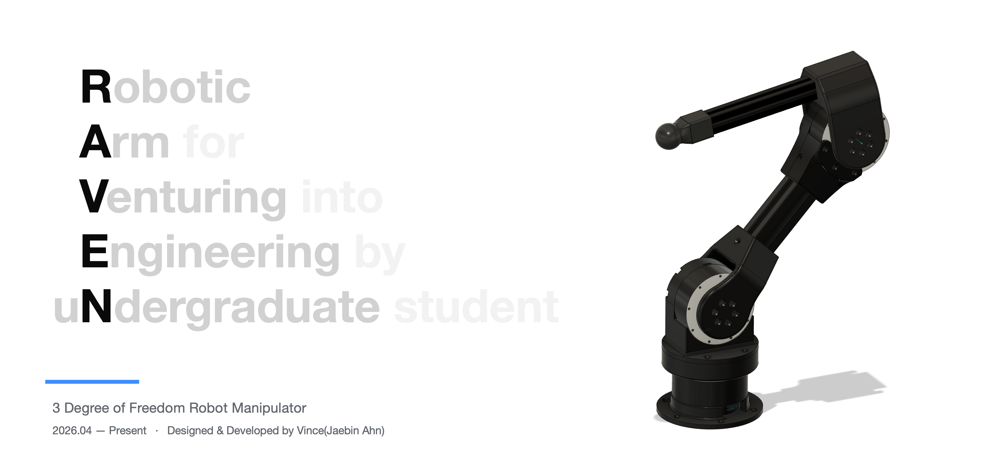

# RAVEN — Hardware

<p align="center">
  <a href="LICENSE"></a>
  
</p>

> **RAVEN** — Robotic Arm for Venturing into Engineering by uNdergraduate student <br>
> 3자유도 로봇 매니퓰레이터의 기구 설계 · CAD · URDF 저장소

<p align="center">
  
</p>

준직접구동(QDD) 액추에이터 기반 3-DOF 로봇 팔 **RAVEN**의 *하드웨어* 리포지토리입니다.<br>
f3d 모델링 파일, 3D 프린팅 3mf 파일, BOM, 그리고 시뮬레이션·제어용 URDF를 관리합니다.

> 이 저장소는 **RAVEN** 프로젝트의 하드웨어 파트입니다. 전체 개요와 하위 저장소는 상위(우산) 저장소에서 관리합니다 → **[RAVEN](https://github.com/jaebin401/RAVEN)**


## 사양

| 항목 | 내용 |
|---|---|
| 자유도 | 3-DOF (revolute × 3) |
| 액추에이터 | Robstride RS02 × 3 (QDD, 피크 17 N·m, 48 V) |
| 프레임 | 2020 · 3030 알루미늄 프로파일 + 3D 프린팅 마운트 |
| 상완(UpperArm) | 3030 알루미늄 프로파일 160 mm |
| 전완(ForeArm) | 2020 알루미늄 프로파일 205 mm (링크 전체 250 mm) |

## 운동학 구조

`urdf/urdf/RAVEN.urdf` (sw2urdf 추출) 기준:

| 조인트 | Parent → Child | 회전축 | 범위 | 동작 |
|---|---|---|---|---|
| `shoulder_Joint` | `base_link` → `shoulder_link` | +Z `(0 0 1)` | −3.14 ~ 3.14 rad | 베이스 요(yaw) |
| `upperArm_Joint` | `shoulder_link` → `upperArm_link` | +Y `(0 1 0)` | 0 ~ 3.14 rad | 숄더 피치 |
| `foreArm_Joint` | `upperArm_link` → `foreArm_link` | −Y `(0 -1 0)` | 0 ~ 3.14 rad | 엘보 피치 |

- 조인트 오프셋(origin, m): `shoulder` (0, 0, 0.0504) · `upperArm` (0, 0.027, 0.07) · `foreArm` (−0.225, ≈0, ≈0)
- `effort` / `velocity` 한계값은 URDF에 미입력(0) 상태 — RS02 사양(rated 6 / peak 17 N·m, 무부하 410 rpm) 반영 예정

## 디렉토리 구조

```
RAVEN_hardware/
├── cad/
│   ├── Link files - .STEP/      # 링크 단위 STEP (sw2urdf용 중립 포맷)
│   ├── modeling files - .f3d/   # Fusion 360 네이티브 (예정)
│   └── part files - .3mf/       # 개별 파트 (3D 프린팅용)
├── urdf/
│   ├── meshes/                  # 링크별 STL
│   └── urdf/                    # RAVEN.urdf + export CSV
├── docs/                        # 파트 네이밍 프로토콜, ADR(예정)
└── images/
    ├── link image/              # 링크 렌더 이미지
    └── part image/              # 파트 렌더 이미지
```

## 파트 네이밍

모든 파트·어셈블리는 [`docs/part_naming_protocol.md`](docs/part_naming_protocol.md)의 규칙을 따릅니다.

```
파트:     (No.)_RVN_(Make)_(Link)_(Function)_v(N)
어셈블리:  RVN_(Link)_ASM_v(N)
```

- **No.** — 3자리 0-padding, 링크별 10단위 블록 (`Base` 000–009 / `Shoulder` 010–019 / `UpperArm` 020–029 / `ForeArm` 030–039, 6-DOF 확장 대비 040번대부터 예약)
- **Make** — `3DP`(프린팅) / `BUY`(구매) / `MCH`(가공)
- **Link** — `Base` / `Shoulder` / `UpperArm` / `ForeArm`
- 어셈블리명은 sw2urdf 작업 시 URDF `<link>` 이름과 일치시킴

## 관련

- 프로젝트 전체(우산) 저장소: **[jaebin401/RAVEN](https://github.com/jaebin401/RAVEN)**
- 제어·펌웨어(SocketCAN, RS02 MIT 모드 등)는 별도 소프트웨어 리포지토리에서 관리
- 상위 통합 대상: 휴머노이드 로봇 **QUB**

## 라이선스

| 대상 | 라이선스 |
|---|---|
| 설계 파일 (CAD `.f3d`, STEP, STL, URDF) | [CERN-OHL-S 2.0](LICENSE) |
| 문서 · 이미지 (README, 네이밍 프로토콜, ADR, `images/*`) | [CC BY 4.0](LICENSE-CC-BY-4.0.txt) |

Copyright © 2026 Jaebin Ahn

설계 파일은 강한 상호주의(strongly reciprocal) 라이선스인 **CERN-OHL-S 2.0**을 따릅니다.
본 설계를 기반으로 하드웨어를 제작·배포·판매하는 경우, 개선·변경된 설계 소스를 동일 라이선스로 공개해야 합니다.
CAD 바이너리처럼 파일 자체에 고지를 넣을 수 없는 산출물의 라이선스 고지는 본 문서로 갈음합니다.

## 작성자

**Jaebin Ahn (jaebin401)**  
학부 기계공학 전공 / 소프트웨어 부전공  
Apple Developer Academy @ POSTECH

목표: 로봇 연구원. 학부 졸업 후 관련분야 대학원 진학 계획.
- GitHub: [@jaebin401](https://github.com/jaebin401)
- Instagram: [통학하는 공대생](https://www.instagram.com/study_4_machine/)
- LinkedIn: [Jaebin Ahn](https://www.linkedin.com/in/jaebin-272ba8366)
